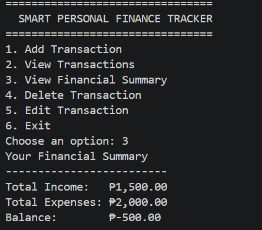

# Smart Personal Finance Tracker

A beginner Python project for tracking personal income and expenses
using SQLite.

## Features

- Add income and expense transactions
- View saved transactions
- Calculate total income, expenses, and balance
- Edit existing transactions
- Delete transactions
- Store records in an SQLite database

## Screenshot

## Tech Stack

- Python
- SQLite
- SQL

## How to Run

1. Install Python 3.
2. Clone or download this project.
3. Open the project folder in a terminal.
4. Run:

   python APP/main.py